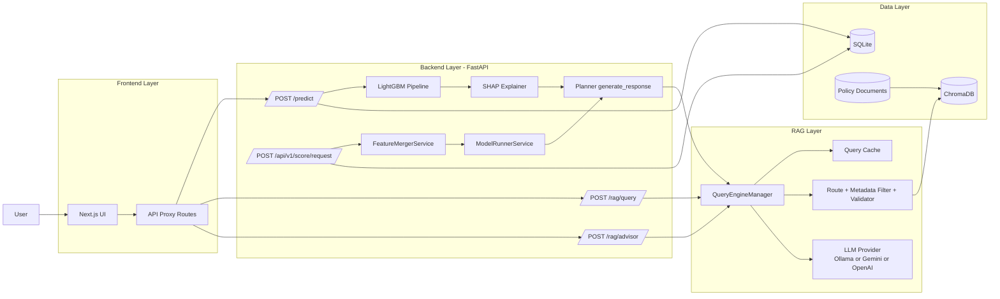
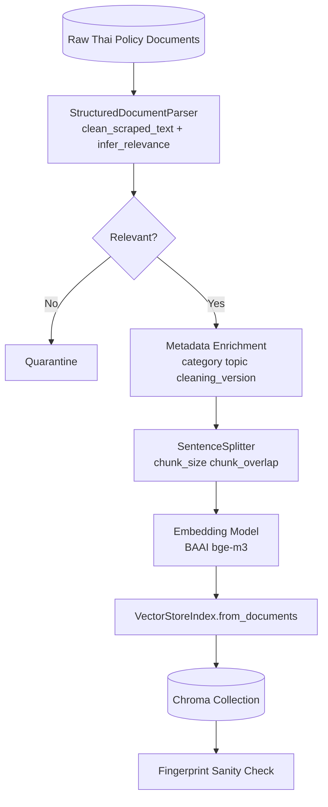

# AI Credit Scoring System: Architecture Context (สำหรับเล่มวิจัย)

## 1) ภาพรวมระบบ
ระบบนี้เป็นแพลตฟอร์มประเมินสินเชื่อที่ผสาน 3 ส่วนหลักเข้าด้วยกัน ได้แก่
1. โมเดลทำนายความเสี่ยงสินเชื่อ (ML Scoring)
2. การอธิบายผลด้วย SHAP (Explainability)
3. ผู้ช่วยเชิงนโยบายด้วย Retrieval-Augmented Generation (RAG) ภาษาไทย

เชิงการใช้งาน ผู้ใช้กรอกข้อมูลผ่านเว็บ จากนั้นระบบจะคำนวณความน่าจะเป็นอนุมัติ/ปฏิเสธ พร้อมเหตุผลเชิงตัวแปรและแผนคำแนะนำเชิงปฏิบัติที่อ้างอิงเอกสารนโยบายสินเชื่อ

## 2) โครงสร้างเชิงชั้น (Logical Architecture)
1. Presentation Layer: `Next.js` UI รับข้อมูลผู้ขอสินเชื่อและแสดงผลคะแนน/คำแนะนำ
2. API Proxy Layer: Next.js API routes ทำหน้าที่ proxy ไป backend (`/predict`, `/rag/query`, `/rag/advisor`)
3. Decisioning Layer: `FastAPI` ประมวลผลโมเดล, SHAP, และ planner logic
4. Knowledge Layer: RAG engine (routing + retrieval + validation + synthesis)
5. Data Layer:
   - SQLite สำหรับ operational records
   - ChromaDB สำหรับเวกเตอร์เอกสารนโยบาย
   - เอกสารต้นทางภาษาไทยใน `backend/data/documents`

## 3) Online Inference Flow (Runtime)
1. ผู้ใช้ส่งแบบฟอร์มจากหน้าเว็บ
2. Frontend ส่งคำขอไป `POST /api/predict`
3. API proxy ส่งต่อไป backend `POST /predict`
4. Backend normalize input และเรียกโมเดลทำนาย
5. Backend คำนวณ SHAP เพื่อหาปัจจัยที่ส่งผลต่อผลการอนุมัติ
6. Planner แปลงผลโมเดล + SHAP เป็นคำแนะนำไทย
7. หาก RAG index พร้อมใช้งาน ระบบดึงหลักฐานเอกสารมาผูกกับข้อแนะนำ
8. Backend ส่งผลลัพธ์รวมกลับ frontend (prediction + confidence + SHAP + planner + sources)
9. ผู้ใช้สามารถถามต่อผ่าน `POST /api/rag/query` หรือ `POST /api/rag/advisor`

## 4) RAG Quality Pipeline
ชั้น RAG ถูกออกแบบแบบ rule-first เพื่อลด domain drift และ hallucination:
1. Query Routing: จัดประเภทคำถามเป็นโดเมนย่อย (เช่น policy, interest, fee, refinance, hardship)
2. Metadata Filtering: กรองเอกสารตามหมวดที่สัมพันธ์กับ route
3. Relevance Validation: กรอง cross-domain nodes และ blocklist
4. Similarity Cutoff + Rerank: คงไว้เฉพาะ context ที่น่าเชื่อถือ
5. Answer Synthesis: สังเคราะห์คำตอบจากบริบทที่ผ่านการตรวจสอบ
6. Source Attachment: แนบแหล่งอ้างอิงเพื่อการตรวจสอบย้อนกลับ
7. Query Cache: ลด latency และลดการเรียกซ้ำ

## 5) Offline Ingestion & Indexing Flow
1. อ่านเอกสารจาก `backend/data/documents`
2. ทำความสะอาดเอกสารด้วย `StructuredDocumentParser`
3. ประเมินความเกี่ยวข้องและแยกเอกสารที่ไม่เกี่ยวข้องออก (quarantine)
4. เติม metadata สำคัญ เช่น category, topic, cleaning_version
5. แบ่งข้อความเป็น chunks ด้วย `SentenceSplitter`
6. แปลงเป็น embeddings (`BAAI/bge-m3`)
7. เขียนเวกเตอร์ลง Chroma collection
8. ตรวจ fingerprint ของ data cleaning เพื่อกัน index drift

## 6) Deployment Context
จาก runbook ปัจจุบัน ระบบรองรับ topology แบบ 3 services:
1. Frontend (`3000`)
2. Backend bridge (`8000`)
3. Planner/RAG service (`8001`)

ในเชิงโค้ด backend ปัจจุบันยังรองรับโหมด unified (เรียก planner/rag modules ภายใน process เดียว) เพื่อใช้งานและทดสอบได้ง่าย

## 7) Mermaid Diagram: End-to-End Architecture


## 8) Mermaid Diagram: Document-to-Index Pipeline


## 9) ข้อความสรุปสั้นสำหรับใส่ในเล่ม (พร้อมใช้)
สถาปัตยกรรมที่พัฒนาขึ้นเป็นระบบตัดสินใจสินเชื่อแบบอธิบายได้ (Explainable Decision Support) โดยผสานโมเดลทำนายความเสี่ยงกับ SHAP และโมดูล RAG ภาษาไทยใน pipeline เดียวกัน ฝั่งรับบริการใช้ Next.js เป็น presentation/proxy layer และ FastAPI เป็น decisioning layer สำหรับคำนวณผลการอนุมัติและสร้างคำแนะนำเฉพาะกรณี ด้านฐานความรู้ใช้ ChromaDB เก็บ embeddings ของเอกสารนโยบายสินเชื่อที่ผ่านกระบวนการทำความสะอาดและคัดกรองความเกี่ยวข้องก่อนทำดัชนี โดยชั้น RAG ใช้ route-aware retrieval, metadata filtering, relevance validation และ similarity cutoff เพื่อลดคำตอบผิดโดเมนและเพิ่มความน่าเชื่อถือของหลักฐานอ้างอิง ผลลัพธ์สุดท้ายจึงสามารถรายงานได้ทั้งคะแนนความเสี่ยง ปัจจัยเชิงอธิบาย และข้อเสนอแนะเชิงนโยบายที่ตรวจสอบย้อนกลับได้จากแหล่งเอกสาร

## 10) Data Inventory จาก Repo (Snapshot)
อ้างอิงจากไฟล์ใน repository ณ วันที่ 2026-04-24

### 10.1 Runtime Data (ที่ระบบใช้งานจริงตอนรัน)
| พาธ | จำนวนไฟล์ | ขนาดรวม | ใช้ทำอะไร |
|---|---:|---:|---|
| `backend/data/documents` | 36 | 0.60 MB | เอกสาร policy/rate/fee/relief ต้นทางสำหรับ RAG ingestion |
| `backend/storage/chroma` | 72 | 73.33 MB | Chroma persistent store สำหรับ retrieval จริง |
| `backend/data/index` | 5 | 0.60 MB | index artifact เสริมในโปรเจกต์ backend |
| `backend/sql_app.db` | 1 | (ไฟล์ฐานข้อมูล) | Operational DB (`credit_score_results`, `audit_logs`) |

### 10.2 Corpus Processing Outcome (จาก parser จริง)
- เอกสารดิบทั้งหมด: `36` ฉบับ
- เอกสารที่ผ่านและถูก index: `25` ฉบับ
- เอกสารที่ถูก quarantine: `11` ฉบับ
- Chunk หลัง split (`chunk_size=512`, `overlap=50`): `103` chunks
- ค่าเฉลี่ย chunks ต่อเอกสารที่ index: `4.12`

### 10.3 Indexed Category Distribution (หลังทำความสะอาด)
| Category | จำนวนเอกสาร |
|---|---:|
| `interest_structure` | 11 |
| `hardship_support` | 6 |
| `refinance` | 3 |
| `policy_requirement` | 3 |
| `fee_structure` | 2 |

### 10.4 Chroma Collections ที่ตรวจพบ
| Path | Collection | จำนวนรายการ |
|---|---|---:|
| `backend/storage/chroma` | `cimb_loans_bge_m3` | 103 |
| `Ai-Credit-Scoring/storage/chroma` | `cimb_loans_bge_m3` | 103 |
| `backend/data/index/chroma` | `credit_policies` | 1 |

หมายเหตุ: collection ที่ใช้งานหลักใน flow backend คือ path ตาม `CHROMA_PERSIST_DIR` (ค่า default `./storage/chroma`)

### 10.5 Raw Document Header Statistics (`backend/data/documents`)
#### CATEGORY (จาก metadata ต้นฉบับในไฟล์)
| Category | จำนวนไฟล์ |
|---|---:|
| `consumer_guideline` | 10 |
| `interest_structure` | 7 |
| `bank_policy` | 5 |
| `regulation` | 4 |
| `fees_charges` | 3 |
| `fee_structure` | 2 |
| `loan_product` | 2 |
| `refinance` | 1 |
| `interest_rates` | 1 |
| `policy_requirement` | 1 |

#### INSTITUTION
- `CIMB Thai` = `36/36` เอกสาร

#### PUBLICATION YEAR (จาก header)
| ปี | จำนวนไฟล์ |
|---|---:|
| 2022 | 1 |
| 2024 | 2 |
| 2025 | 5 |
| 2026 | 28 |

## 11) Model/Feature Data ที่ใช้จริง

### 11.1 โมเดลที่ endpoint `/predict` ใช้จริง
- โมเดลโหลดจาก `backend/model/lgbm_model.pkl` (Pipeline)
- Raw feature ที่โมเดลต้องการ: `15` ตัวแปร
- Transformed feature หลัง preprocessing: `22` ตัวแปร

#### Raw feature list (15)
`Sex`, `Occupation`, `Salary`, `Marriage_Status`, `credit_score`, `credit_grade`, `outstanding`, `overdue`, `Coapplicant`, `loan_amount`, `loan_term`, `Interest_rate`, `dti`, `lti`, `has_overdue`

#### Engineered features (คำนวณใน runtime ก่อนเข้ารุ่น)
- `dti = outstanding / Salary`
- `lti = loan_amount / Salary`
- `has_overdue = 1 ถ้า overdue > 0`

### 11.2 Runtime Input Payload ที่ระบบ normalize
ฟิลด์หลักที่ใช้ใน `/predict`:
- `Sex`, `Occupation`, `Salary`, `Marriage_Status`
- `credit_score`, `credit_grade`
- `outstanding`, `overdue`
- `Coapplicant`, `loan_amount`, `loan_term`, `Interest_rate`

ระบบมี distribution warnings ถ้าค่าอยู่นอกช่วงที่โมเดลเคยเรียนรู้ (เช่น salary/loan/rate/term)

### 11.3 ข้อมูลสำหรับ `/api/v1/score/request` (อีกเส้นทางหนึ่ง)
เส้นทางนี้ใช้ schema เชิงธุรกิจ:
- demographics: `age`, `employment_status`, `education_level`, `marital_status`
- financials: `monthly_income`, `monthly_expenses`, `existing_debt`
- loan_details: `loan_amount`, `loan_term_months`, `loan_purpose`

และเรียก `FeatureMergerService` เพื่อเติมประวัติลูกค้า (ปัจจุบันยังเป็น placeholder บางส่วน เช่น `credit_bureau_score`, `credit_grade`)

## 12) Data ที่เป็น Offline/Research (ไม่ใช่ runtime scoring โดยตรง)

### 12.1 Training Dataset
- ไฟล์: `Ai-Credit-Scoring/data/training/loan_dataset_sample.csv`
- Shape: `(500 rows, 14 columns)`
- Target distribution: `Rejected=255`, `Approved=245`
- Target field: `loan_status`

### 12.2 Evaluation Dataset
| ไฟล์ | จำนวนรายการ |
|---|---:|
| `Ai-Credit-Scoring/data/eval/test_cases.jsonl` | 22 |
| `Ai-Credit-Scoring/data/eval/advisor_test_set.jsonl` | 100 |
| `Ai-Credit-Scoring/data/eval/advisor_results.jsonl` | 83 |

จาก `Ai-Credit-Scoring/data/eval/summary.json` (overall `a1`):
- `n=5`, `latency_mean_s=46.03`, `avg_n_sources=8.8`, `keyword_recall=0.5`

### 12.3 Research Source Inventory
- `Ai-Credit-Scoring/data/credit_scoring_research/task_a_source_inventory.csv`: shape `(36, 17)`
- `Ai-Credit-Scoring/data/credit_scoring_research/task_a_sources.json`: `sources_len=36`

## 13) Endpoint-by-Endpoint: ใช้ data ไหน อย่างไร
| Endpoint | รับข้อมูลจาก | อ่านข้อมูลเพิ่มจาก | เขียนผลลง |
|---|---|---|---|
| `POST /predict` | Frontend payload | `lgbm_model.pkl`, SHAP explainer, RAG (Chroma) | ส่ง JSON กลับ client |
| `POST /rag/query` | คำถามผู้ใช้ | Chroma index + router/validator/cache | ส่ง answer+sources |
| `POST /rag/advisor` | คำถาม + profile | Chroma + LLM reasoning | ส่ง verdict/checklist/actions |
| `POST /api/v1/score/request` | ScoringRequest schema | Historical DB ผ่าน FeatureMerger + ModelRunner + Planner/RAG | table `credit_score_results` |
| `POST /api/v1/plan/external` | user_input + model_output + shap_json | Planner + RAG lookup | ส่งแผนไทย + sources |
| Ingestion (`python -m app.ingest`) | เอกสาร `.txt` ใน documents dir | parser + embedding model | Chroma collection |

## 14) Config ที่กำหนดว่า data path ไหนถูกใช้
ค่า default จาก `backend/config/settings.py`:
- `DATA_DIR` default: `./data/documents`
- `DOCUMENTS_DIR`: resolve จาก `DATA_DIR`
- `CHROMA_PERSIST_DIR` default: `./storage/chroma`
- `CHROMA_COLLECTION` default: `credit_policies`
- `CHUNK_SIZE=512`, `CHUNK_OVERLAP=50`
- `SIMILARITY_TOP_K=4`, `SIMILARITY_CUTOFF=0.45`
- `DATABASE_URL=sqlite:///./sql_app.db`

## 15) SQL Runtime Snapshot
ตรวจจาก `backend/sql_app.db`:
- ตาราง `audit_logs`: 0 rows
- ตาราง `credit_score_results`: 0 rows

หมายเหตุ: จำนวนแถวใน runtime DB จะเพิ่มเมื่อเรียก endpoint ที่มีการบันทึกผล (`/api/v1/score/request`) ใน environment ที่ใช้งานจริง

## 16) Repro Commands (สำหรับอ้างอิงในภาคผนวก)
```powershell
# 1) parser outcome: total/indexed/quarantine
@'
from pathlib import Path
from backend.app.document_parser import StructuredDocumentParser
StructuredDocumentParser.parse_directory(Path("backend/data/documents"))
print(StructuredDocumentParser.get_last_parse_report())
'@ | python -

# 2) chunk count
@'
from pathlib import Path
from backend.app.document_parser import StructuredDocumentParser
from llama_index.core.node_parser import SentenceSplitter
docs = StructuredDocumentParser.parse_directory(Path("backend/data/documents"))
nodes = SentenceSplitter(chunk_size=512, chunk_overlap=50).get_nodes_from_documents(docs)
print(len(docs), len(nodes))
'@ | python -

# 3) chroma collection count
@'
import chromadb
client = chromadb.PersistentClient(path="backend/storage/chroma")
col = client.get_collection("cimb_loans_bge_m3")
print(col.count())
'@ | python -
```
